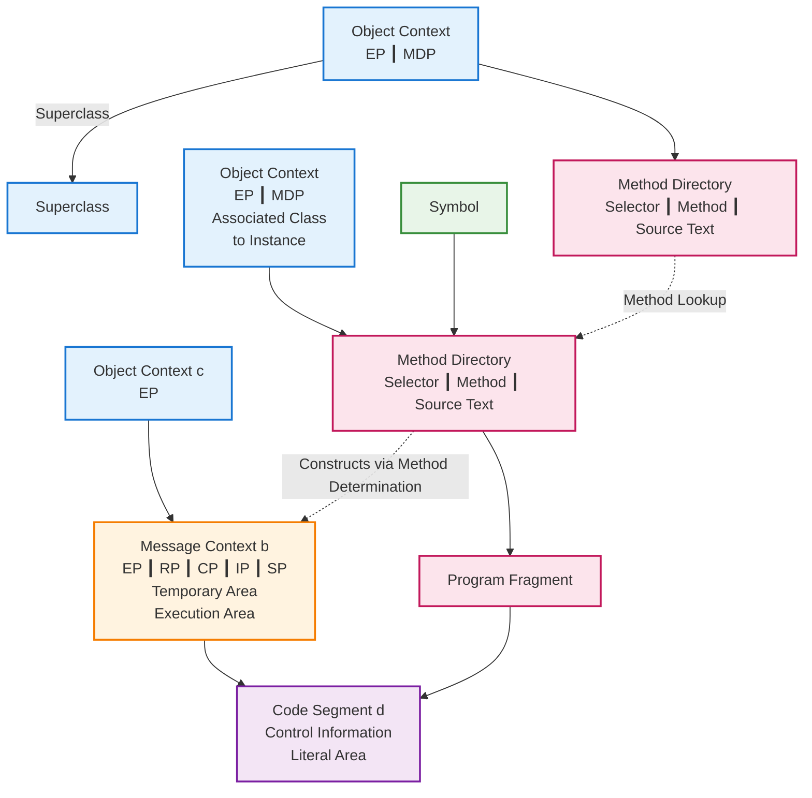
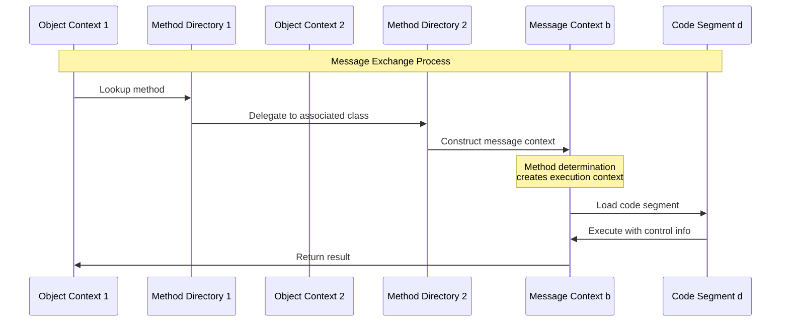

# Message Exchange Schema II

## Original: Abb. 7.3 Schema eines Botschaftenaustausches II
**Translation**: Figure 7.3 Schema of a Message Exchange II

## German Terms Translation
- **OBJEKTKONTUR** → Object Context
- **METHODENVERZEICHNIS** → Method Directory
- **SELEKTOR** → Selector
- **METHODE** → Method
- **QUELLTEXT** → Source Text
- **BOTSCHAFTSKONTUR** → Message Context
- **TEMPORÄREBEREICH** → Temporary Area
- **AUSWERTUNGSBEREICH** → Execution Area
- **CODESEGMENT** → Code Segment
- **Steuerangaben** → Control Information
- **LITERALBEREICH** → Literal Area
- **PROGRAMMFRAGMENT** → Program Fragment
- **zugehörige Klasse zu Exemplar** → "associated class to instance"
- **durch Methodenbestimmung konstruiert** → "constructed through method determination"

## Mermaid Diagram

## Sequence View

