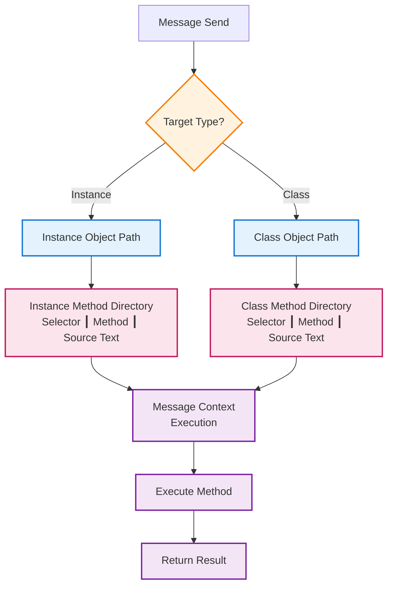
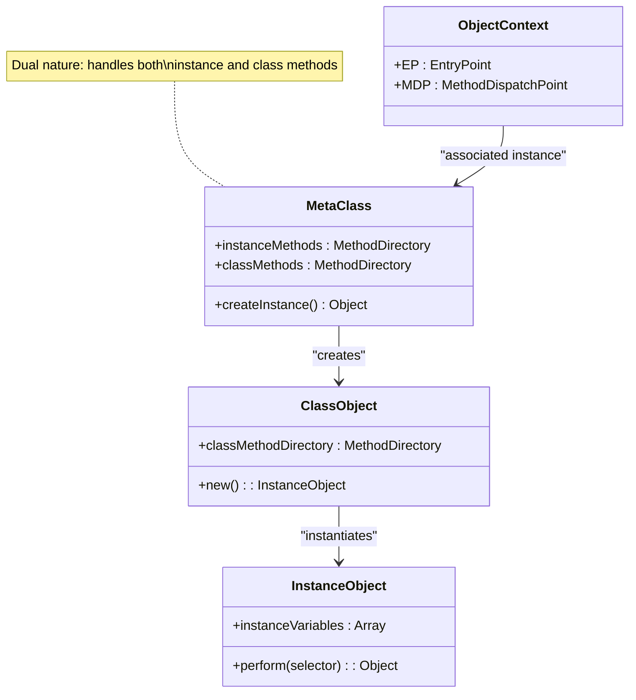

# Message Exchange Schema III

## Original: Abb. 7.4 Schema eines Botschaftenaustausches III  
**Translation**: Figure 7.4 Schema of a Message Exchange III

## German Terms Translation
- **OBJEKTKONTUR** → Object Context
- **METHODENVERZEICHNIS** → Method Directory
- **SELEKTOR** → Selector  
- **METHODE** → Method
- **QUELLTEXT** → Source Text
- **BOTSCHAFTSKONTUR** → Message Context
- **TEMPORÄREBEREICH** → Temporary Area
- **AUSWERTUNGSBEREICH** → Execution Area
- **CODESEGMENT** → Code Segment
- **Steuerangaben** → Control Information
- **LITERALBEREICH** → Literal Area
- **zugehöriges Exemplar von MetaClass** → "associated instance of MetaClass"
- **Klassenobjekt** → "Class Object"  
- **Exemplarobjekt** → "Instance Object"
- **für Methoden von Exemplaren** → "for methods of instances"
- **für Methoden von Klassen** → "for methods of classes"

## German Text Translation
**"Die 'Doppelnatur' einer Objektkontur bei einer Botschaft an die Exemplar- oder eine Klasse. Es wird stets das Methodenverzeichnis der Klasse des Botschaftsempfängers verwendet. Diese Klasse ist zu einem Objektidentifikator stets ermittelbar, üblicherweise aus dem Identifikator."**

**Translation**: "The 'dual nature' of an object context when sending a message to an instance or a class. The method directory of the message receiver's class is always used. This class can always be determined from an object identifier, typically from the identifier itself."

## Mermaid Diagram

```mermaid
graph TB
    %% Top Level Object Contexts  
    OC1["Object Context<br/>EP"]
    OC2["Object Context<br/>EP"]
    
    %% Class relationships
    OC1 -.->|"Superclass"| SuperClass1["Superclass"]
    OC2 -.->|"Superclass"| SuperClass2["Superclass"]
    
    %% MetaClass Structure
    subgraph Meta["MetaClass System"]
        OC3["Object Context<br/>EP ┃ MDP<br/>Associated Instance<br/>of MetaClass"]
        
        OC4["Object Context<br/>EPc ┃ MDP<br/>Class Object"]
        
        OC5["Object Context<br/>EP<br/>Instance Object"]
    end
    
    %% Method Directories
    MD1["Method Directory<br/>for Methods of Instances<br/>Selector ┃ Method ┃ Source Text"]
    
    MD2["Method Directory<br/>for Methods of Classes<br/>Selector ┃ Method ┃ Source Text"]
    
    %% Connections
    OC3 --> MD1
    OC4 --> MD2
    OC3 --> OC4
    OC4 --> OC5
    
    %% Message Context and Code Segment  
    OC5 --> MC["Message Context<br/>EP ┃ RP ┃ CP ┃ IP ┃ SP<br/>Temporary Area<br/>Execution Area"]
    
    MC --> CS["Code Segment<br/>Control Information<br/>Literal Area"]
    
    %% Method lookup flow
    MD1 -.->|"Instance Method Lookup"| MC
    MD2 -.->|"Class Method Lookup"| MC
    
    %% Styling
    classDef objectContext fill:#e3f2fd,stroke:#1976d2,stroke-width:2px
    classDef messageContext fill:#fff3e0,stroke:#f57c00,stroke-width:2px  
    classDef method fill:#fce4ec,stroke:#c2185b,stroke-width:2px
    classDef code fill:#f3e5f5,stroke:#7b1fa2,stroke-width:2px
    classDef metaclass fill:#e8f5e8,stroke:#388e3c,stroke-width:2px
    
    class OC1,OC2,OC5,SuperClass1,SuperClass2 objectContext
    class OC3,OC4 metaclass
    class MC messageContext  
    class MD1,MD2 method
    class CS code
```

## Dual Nature Concept



## MetaClass Relationship

