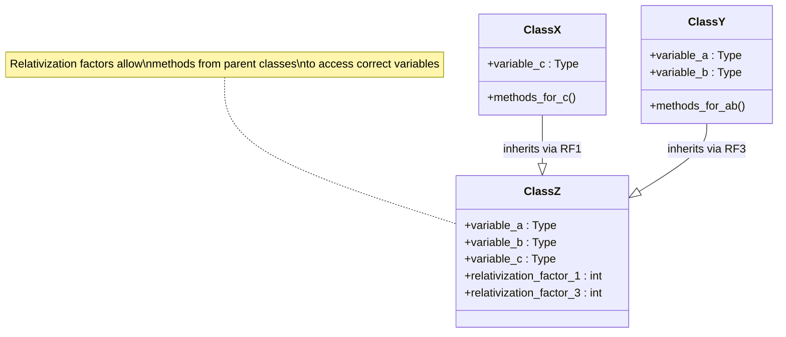

# Multiple Inheritance - Variable Addressing

## Original: Abb. 7.18 Adressierung von Variablen bei mehrfacher Vererbung
**Translation**: Figure 7.18 Addressing of Variables in Multiple Inheritance

## German Terms Translation
- **OBJEKTKONTUR** → Object Context
- **Oberklasse** → Superclass  
- **Relativierungsfaktor** → Relativization Factor
- **Durch den Relativierungsfaktor können die Methoden der Klasse x weiterhin die Exemplarvariable c als 1. (indizierte) Exemplarvariable auch in Exemplaren der Klasse z ansprechen** → "Through the relativization factor, the methods of class x can continue to address instance variable c as the 1st (indexed) instance variable even in instances of class z"

## Mermaid Diagram

```mermaid
graph TB
    %% Top level inheritance
    subgraph Upper["Upper Level Classes"]
        OCX["Object Context X<br/>EPc ┃ MDP"]
        OC1["Object Context<br/>EP"]
        OCY["Object Context Y<br/>EPc ┃ MDP"] 
        OC2["Object Context<br/>EP"]
    end
    
    %% Superclass connections
    OCX -.->|"Superclass"| OC1
    OCY -.->|"Superclass"| OC2
    
    %% Variables
    OC1 --> VAR_C["⟨c⟩"]
    OC2 --> VAR_A["⟨a⟩"]
    OC2 --> VAR_B["⟨b⟩"]
    
    %% Lower level - Multiple Inheritance
    subgraph Lower["Multiple Inheritance Level"]
        RF1["EP<br/>Relativization Factor 1"]
        RF3["EP<br/>Relativization Factor 3"]
        
        OCZ["Object Context Z<br/>EPc ┃ MDP"]
        OC3["Object Context<br/>EP"]
    end
    
    %% Inheritance connections
    OCX -.->|"Inherits from"| RF1
    OCY -.->|"Inherits from"| RF3
    RF1 --> OCZ
    RF3 --> OCZ
    OCZ --> OC3
    
    %% Multiple inheritance variables
    OC3 --> VAR_A2["⟨a⟩"]
    OC3 --> VAR_B2["⟨b⟩"] 
    OC3 --> VAR_C2["⟨c⟩"]
    
    %% Styling
    classDef objectContext fill:#e3f2fd,stroke:#1976d2,stroke-width:2px
    classDef variable fill:#e8f5e8,stroke:#388e3c,stroke-width:2px
    classDef relativization fill:#fff3e0,stroke:#f57c00,stroke-width:2px
    
    class OCX,OC1,OCY,OC2,OCZ,OC3 objectContext
    class VAR_C,VAR_A,VAR_B,VAR_A2,VAR_B2,VAR_C2 variable  
    class RF1,RF3 relativization
```

## Conceptual View

