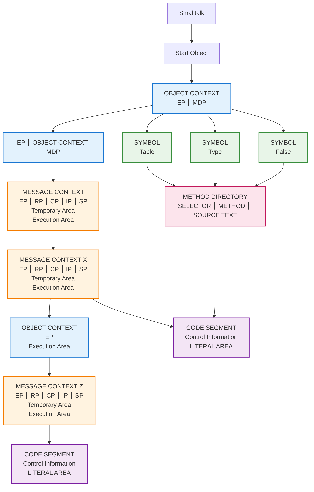
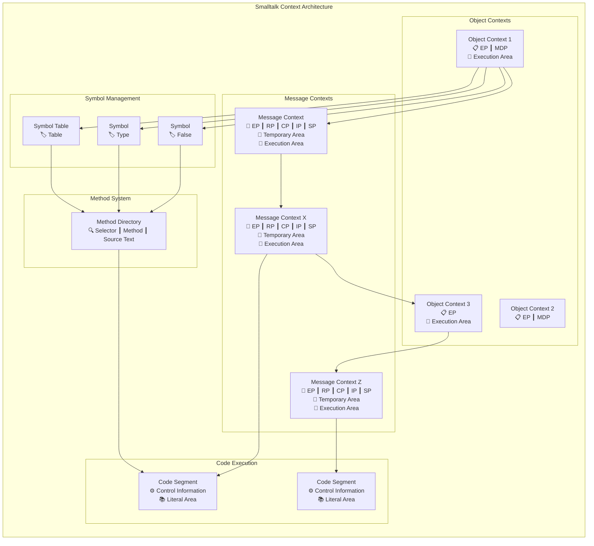
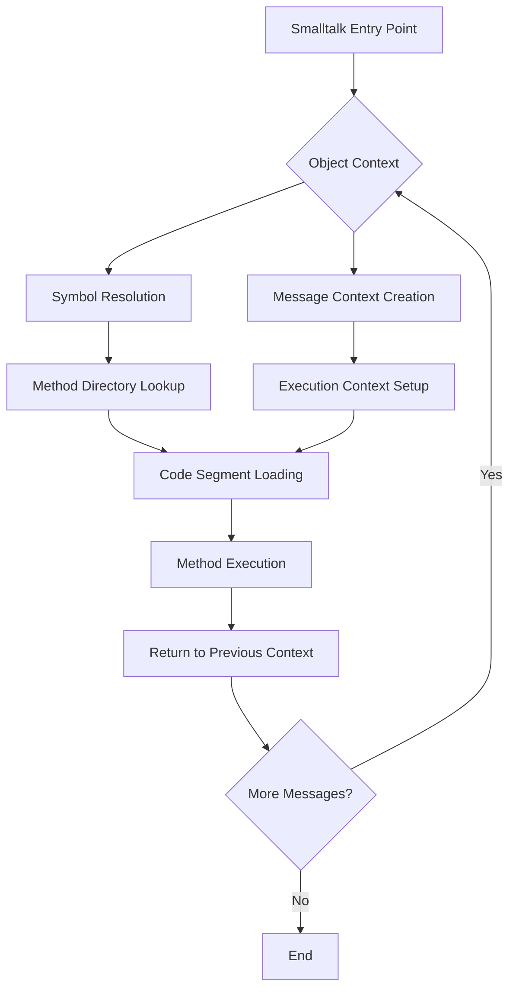

# Schema: PASCAL vs Smalltalk Context Comparison

## Original Image Analysis
This diagram shows "Abb. 7.7 Vergleich von PASCAL / Smalltalk Kontexten" (Figure 7.7 Comparison of PASCAL / Smalltalk Contexts)

## German Terms Translation
- **BOTSCHAFTSKONTEXT** → Message Context
- **OBJEKTKONTEXT** → Object Context  
- **EP** → Entry Point
- **RP** → Return Point
- **CP** → Current Point
- **IP** → Instruction Pointer
- **SP** → Stack Pointer
- **TEMPORÄREBEREICH** → Temporary Area
- **AUSFÜHRUNGSBEREICH** → Execution Area
- **METHODENVERZEICHNIS** → Method Directory
- **SELECTOR** → Selector
- **METHODE** → Method
- **QUELLTEXT** → Source Text
- **CODESEGMENT** → Code Segment
- **Steuerangaben** → Control Information
- **LITERALBEREICH** → Literal Area

## Mermaid Diagram

## Alternative Detailed View

## System Architecture Summary

