# Schema: PASCAL vs Smalltalk Context Comparison

## Original Image Analysis
This diagram shows "Abb. 7.7 Vergleich von PASCAL / Smalltalk Kontexten" (Figure 7.7 Comparison of PASCAL / Smalltalk Contexts)

## German Terms Translation
- **BOTSCHAFTSKONTEXT** → Message Context
- **OBJEKTKONTEXT** → Object Context  
- **EP** → Entry Point
- **RP** → Return Point
- **CP** → Current Point
- **IP** → Instruction Pointer
- **SP** → Stack Pointer
- **TEMPORÄREBEREICH** → Temporary Area
- **AUSFÜHRUNGSBEREICH** → Execution Area
- **METHODENVERZEICHNIS** → Method Directory
- **SELECTOR** → Selector
- **METHODE** → Method
- **QUELLTEXT** → Source Text
- **CODESEGMENT** → Code Segment
- **Steuerangaben** → Control Information
- **LITERALBEREICH** → Literal Area

## Mermaid Diagram

```mermaid
graph TB
    %% Smalltalk System
    ST["Smalltalk"] --> OBJ_START["Start Object"]
    
    %% Object Context Chain
    OBJ_START --> OC1["OBJECT CONTEXT<br/>EP ┃ MDP"]
    OC1 --> OC2["EP ┃ OBJECT CONTEXT MDP"]
    OC2 --> MC1["MESSAGE CONTEXT<br/>EP ┃ RP ┃ CP ┃ IP ┃ SP<br/>Temporary Area<br/>Execution Area"]
    
    %% Message Context Chain  
    MC1 --> MC2["MESSAGE CONTEXT X<br/>EP ┃ RP ┃ CP ┃ IP ┃ SP<br/>Temporary Area<br/>Execution Area"]
    MC2 --> OC3["OBJECT CONTEXT<br/>EP<br/>Execution Area"]
    OC3 --> MC3["MESSAGE CONTEXT Z<br/>EP ┃ RP ┃ CP ┃ IP ┃ SP<br/>Temporary Area<br/>Execution Area"]
    
    %% Symbol Tables
    OC1 --> ST1["SYMBOL<br/>Table"]
    OC1 --> ST2["SYMBOL<br/>Type"]
    OC1 --> ST3["SYMBOL<br/>False"]
    
    %% Method Directory
    ST1 --> MD1["METHOD DIRECTORY<br/>SELECTOR ┃ METHOD ┃ SOURCE TEXT"]
    ST2 --> MD1
    ST3 --> MD1
    
    %% Code Segments
    MD1 --> CS1["CODE SEGMENT<br/>Control Information<br/>LITERAL AREA"]
    MC2 --> CS1
    
    MC3 --> CS2["CODE SEGMENT<br/>Control Information<br/>LITERAL AREA"]
    
    %% Styling for different components
    classDef objectContext fill:#e3f2fd,stroke:#1976d2,stroke-width:2px
    classDef messageContext fill:#fff3e0,stroke:#f57c00,stroke-width:2px  
    classDef symbol fill:#e8f5e8,stroke:#388e3c,stroke-width:2px
    classDef method fill:#fce4ec,stroke:#c2185b,stroke-width:2px
    classDef code fill:#f3e5f5,stroke:#7b1fa2,stroke-width:2px
    
    class OC1,OC2,OC3 objectContext
    class MC1,MC2,MC3 messageContext
    class ST1,ST2,ST3 symbol
    class MD1 method
    class CS1,CS2 code
```

## Alternative Detailed View

```mermaid
graph LR
    subgraph "Smalltalk Context Architecture"
        subgraph "Object Contexts"
            OC1["Object Context 1<br/>📋 EP ┃ MDP<br/>🔧 Execution Area"]
            OC2["Object Context 2<br/>📋 EP ┃ MDP"]
            OC3["Object Context 3<br/>📋 EP<br/>🔧 Execution Area"]
        end
        
        subgraph "Message Contexts"  
            MC1["Message Context<br/>📍 EP ┃ RP ┃ CP ┃ IP ┃ SP<br/>💾 Temporary Area<br/>🔧 Execution Area"]
            MC2["Message Context X<br/>📍 EP ┃ RP ┃ CP ┃ IP ┃ SP<br/>💾 Temporary Area<br/>🔧 Execution Area"]
            MC3["Message Context Z<br/>📍 EP ┃ RP ┃ CP ┃ IP ┃ SP<br/>💾 Temporary Area<br/>🔧 Execution Area"]
        end
        
        subgraph "Symbol Management"
            ST["Symbol Table<br/>🏷️ Table"]
            SType["Symbol<br/>🏷️ Type"] 
            SFalse["Symbol<br/>🏷️ False"]
        end
        
        subgraph "Method System"
            MD["Method Directory<br/>🔍 Selector ┃ Method ┃ Source Text"]
        end
        
        subgraph "Code Execution"
            CS1["Code Segment<br/>⚙️ Control Information<br/>📚 Literal Area"]
            CS2["Code Segment<br/>⚙️ Control Information<br/>📚 Literal Area"]
        end
    end
    
    %% Connections
    OC1 --> MC1
    MC1 --> MC2  
    MC2 --> OC3
    OC3 --> MC3
    
    OC1 --> ST
    OC1 --> SType
    OC1 --> SFalse
    
    ST --> MD
    SType --> MD
    SFalse --> MD
    
    MD --> CS1
    MC2 --> CS1
    MC3 --> CS2
```

## System Architecture Summary

