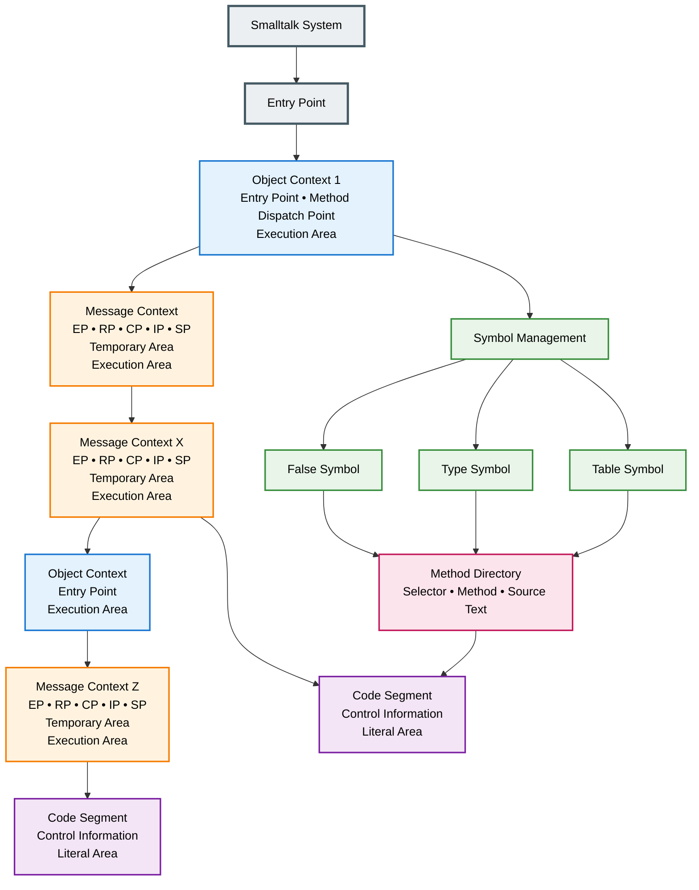

```mermaid
graph TB
    %% Main Smalltalk Entry Point
    ST[Smalltalk System] --> START[Entry Point]
    
    %% Object Context Layer
    START --> OC1[Object Context 1<br/>Entry Point • Method Dispatch Point<br/>Execution Area]
    
    %% Symbol and Method Management
    OC1 --> SYMBOLS[Symbol Management]
    SYMBOLS --> ST1[Table Symbol]
    SYMBOLS --> ST2[Type Symbol] 
    SYMBOLS --> ST3[False Symbol]
    
    %% Method Directory Connection
    ST1 --> MD[Method Directory<br/>Selector • Method • Source Text]
    ST2 --> MD
    ST3 --> MD
    
    %% Message Context Chain
    OC1 --> MC1[Message Context<br/>EP • RP • CP • IP • SP<br/>Temporary Area<br/>Execution Area]
    
    MC1 --> MC2[Message Context X<br/>EP • RP • CP • IP • SP<br/>Temporary Area<br/>Execution Area]
    
    MC2 --> OC2[Object Context<br/>Entry Point<br/>Execution Area]
    
    OC2 --> MC3[Message Context Z<br/>EP • RP • CP • IP • SP<br/>Temporary Area<br/>Execution Area]
    
    %% Code Segments
    MD --> CS1[Code Segment<br/>Control Information<br/>Literal Area]
    MC2 --> CS1
    
    MC3 --> CS2[Code Segment<br/>Control Information<br/>Literal Area]
    
    %% Styling
    classDef objectCtx fill:#E3F2FD,stroke:#1976D2,stroke-width:2px,color:#000
    classDef messageCtx fill:#FFF3E0,stroke:#F57C00,stroke-width:2px,color:#000
    classDef symbol fill:#E8F5E8,stroke:#388E3C,stroke-width:2px,color:#000
    classDef method fill:#FCE4EC,stroke:#C2185B,stroke-width:2px,color:#000
    classDef code fill:#F3E5F5,stroke:#7B1FA2,stroke-width:2px,color:#000
    classDef system fill:#ECEFF1,stroke:#455A64,stroke-width:3px,color:#000
    
    class OC1,OC2 objectCtx
    class MC1,MC2,MC3 messageCtx
    class ST1,ST2,ST3,SYMBOLS symbol
    class MD method
    class CS1,CS2 code
    class ST,START system
```