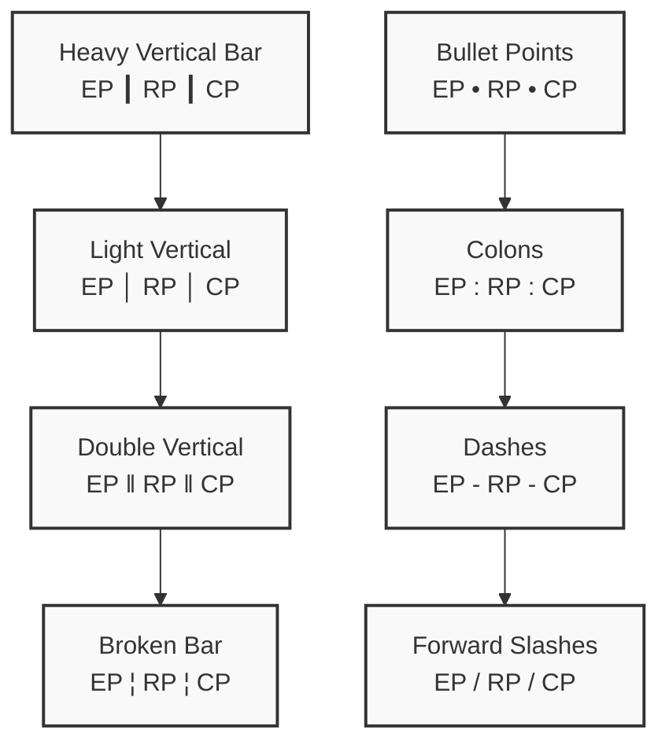
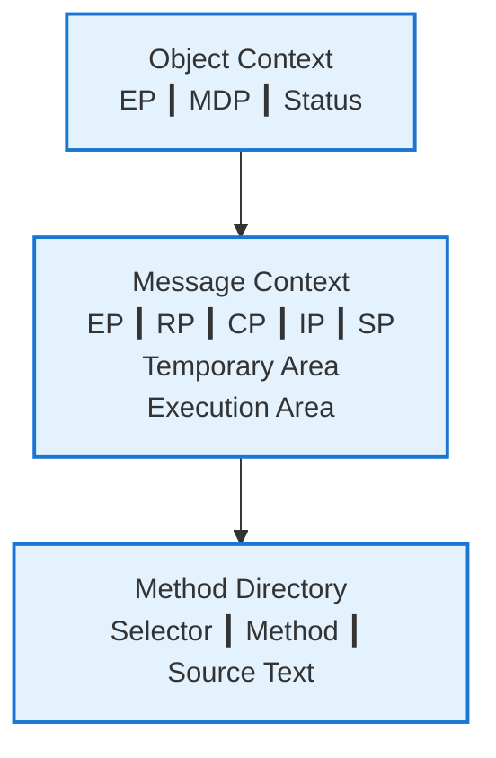

# Mermaid Vertical Separator Test

## Different Vertical Line Options

## Recommended: Heavy Vertical Bar (┃)

## How to Type These Characters

### Windows:
- **Heavy Vertical Bar (┃)**: Alt + 9475 (on numpad)
- **Light Vertical (│)**: Alt + 179 (on numpad)

### Mac:
- **Use Character Viewer**: Cmd + Ctrl + Space, search "vertical"

### Linux:
- **Compose key**: Compose + | + |
- **Unicode input**: Ctrl + Shift + U, then 2503

### Any Platform:
- **Copy from here**: ┃ │ ‖ ¦
- **HTML entities**: `&#x2503;` for ┃