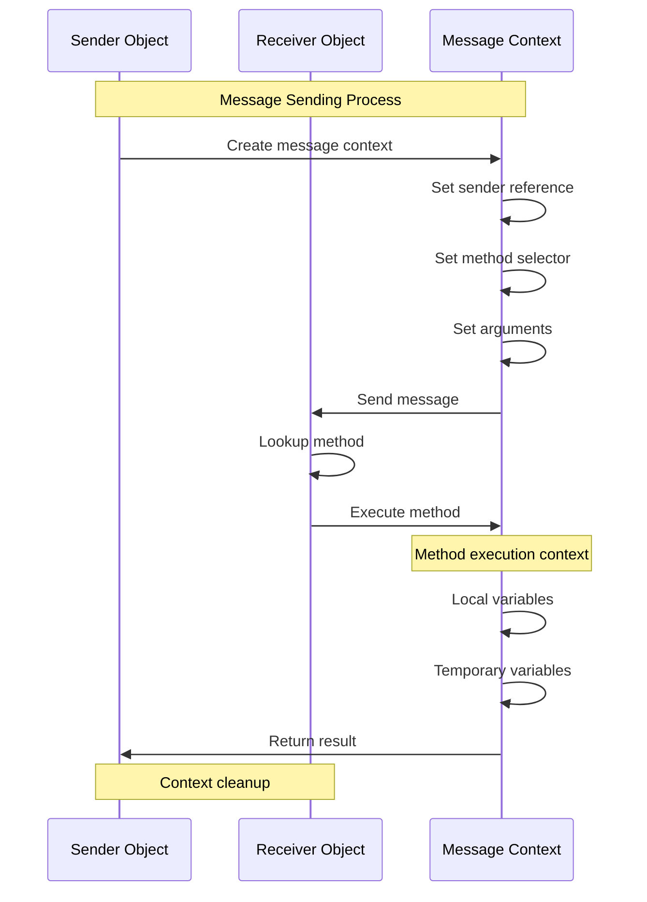
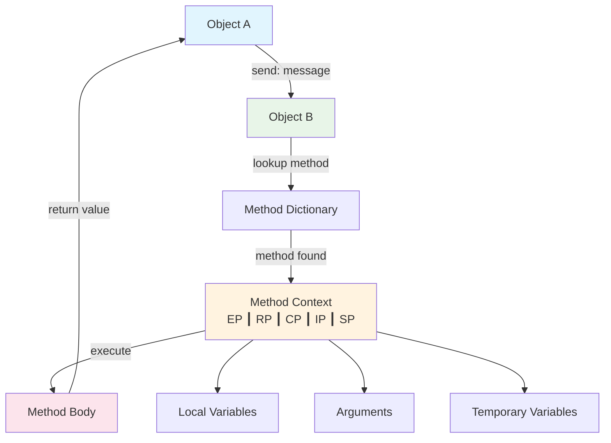
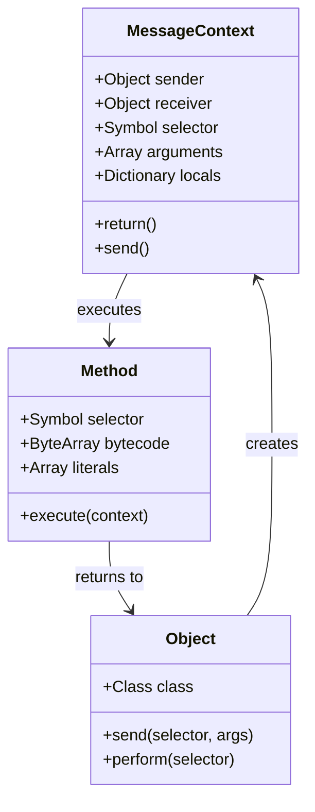

```mermaid
sequenceDiagram
    participant Sender as Sender Object
    participant Receiver as Receiver Object
    participant Context as Message Context
    
    Note over Sender, Context: Message Sending Process
    
    Sender->>Context: Create message context
    Context->>Context: Set sender reference
    Context->>Context: Set method selector
    Context->>Context: Set arguments
    
    Context->>Receiver: Send message
    Receiver->>Receiver: Lookup method
    Receiver->>Context: Execute method
    
    Note over Context: Method execution context
    Context->>Context: Local variables
    Context->>Context: Temporary variables
    
    Context->>Sender: Return result
    
    Note over Sender, Receiver: Context cleanup
```

```mermaid
graph TD
    A["Object A"] -->|"send: message"| B["Object B"]
    B -->|"lookup method"| C["Method Dictionary"]
    C -->|"method found"| D["Method Context<br/>EP ┃ RP ┃ CP ┃ IP ┃ SP"]
    D -->|"execute"| E["Method Body"]
    E -->|"return value"| A
    
    D --> F["Local Variables"]
    D --> G["Arguments"]
    D --> H["Temporary Variables"]
    
    style A fill:#e1f5fe
    style B fill:#e8f5e8
    style D fill:#fff3e0
    style E fill:#fce4ec
```

```mermaid
classDiagram
    class MessageContext {
        +Object sender
        +Object receiver  
        +Symbol selector
        +Array arguments
        +Dictionary locals
        +return()
        +send()
    }
    
    class Object {
        +Class class
        +send(selector, args)
        +perform(selector)
    }
    
    class Method {
        +Symbol selector
        +ByteArray bytecode
        +Array literals
        +execute(context)
    }
    
    Object --> MessageContext : creates
    MessageContext --> Method : executes
    Method --> Object : returns to
```