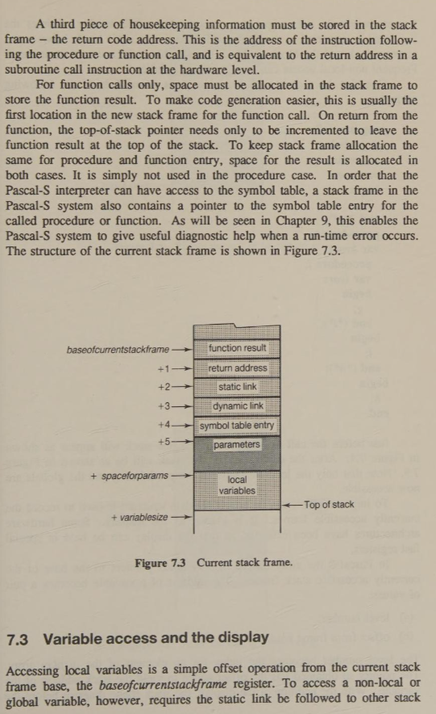
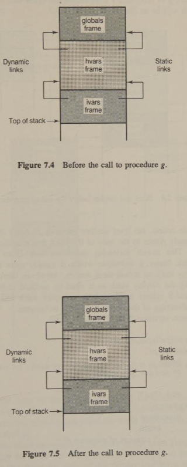
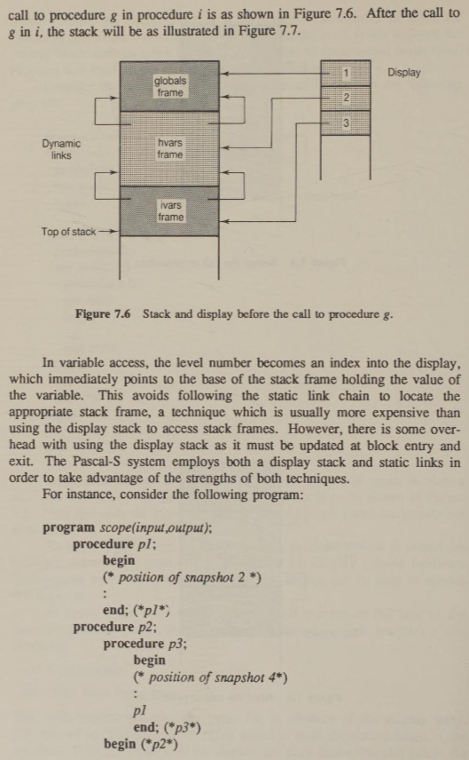

# Pascal-S Virtual Machine Stack Frames

## 7.2 Stack frames

Space for all variables in a user's program is allocated on the stack. In a block-structured language, the space for the local variables of a procedure or function must be allocated at block entry (in Pascal and Pascal-S this corresponds to entry into a procedure or function). The space for local variables must stay in existence until the block completes execution and since the code of a block may call other blocks, including itself, space allocation for variables is nested. A stack structure is therefore ideal.

Each procedure entry or function call necessitates the allocation of space for parameters and local variables and this space is known as the stack frame or activation record. Recall, however, that within a particular block reference may be made to any variables declared in enclosing blocks, and to those at the level of the main program (these are known as non-local and global variables respectively). A link to the stack frames for these blocks must be preserved. This is known as the static link because it can be determined by inspecting the static program listing. Space for the static link must be allocated as each stack frame is created. The various static links form a backward-pointing chain through which each nested stack frame can be reached.

The size of the stack frame varies from procedure to procedure and will depend on the number of parameters and local variables in the procedure. At procedure exit it is necessary to update the base address of the current stack frame to that of the calling procedure. A second type of link is required to record this information. This is known as the dynamic link as it records the dynamic calling sequence of the procedures and functions at run-time. Note that the dynamic link will always point back to the base of the previous stack frame on the stack.

A third piece of housekeeping information must be stored in the stack frame - the return code address. This is the address of the instruction following the procedure or function call, and is equivalent to the return address in a subroutine call instruction at the hardware level.

For function calls only, space must be allocated in the stack frame to store the function result. To make code generation easier, this is usually the first location in the new stack frame for the function call. On return from the function, the top-of-stack pointer needs only to be incremented to leave the function result at the top of the stack. To keep stack frame allocation the same for procedure and function entry, space for the result is allocated in both cases. It is simply not used in the procedure case. In order that the Pascal-S interpreter can have access to the symbol table, a stack frame in the Pascal-S system also contains a pointer to the symbol table entry for the called procedure or function. As will be seen in Chapter 9, this enables the Pascal-S system to give useful diagnostic help when a run-time error occurs. The structure of the current stack frame is shown in Figure 7.3.

## 7.3 Variable access and the display

Accessing local variables is a simple offset operation from the current stack frame base, the *baseofcurrentstackframe* register. To access a non-local or global variable, however, requires the static link be followed to other stack frames, before the offset operation is performed. The number of times the link must be traversed is simply the difference in nesting levels between the current block and the block in which the variable to be accessed is declared. Frequent non-local access can impose a large overhead.

Consider the sequence of procedure calls at run-time in the following program:

```pascal
program calls;
var globals
    procedure g;
    var gvars
    begin
    ...
    end (*g*);
    procedure h;
    var hvars
        procedure i;
        var ivars
        begin
        g;
        end (*i*);
    begin
    i;
    end (*h*);
begin
h;
end.
```

Just before the call to g in procedure i, the stack will appear as shown in Figure 7.4. After the call to g in i, the stack will be as shown in Figure 7.5. Note that only the local variables of the procedure g and the globals are now accessible.

To improve efficiency, an additional data structure is used to record the currently accessible frames. It is known as the display. Some hardware architectures have been extended so that the display can be held in special fast registers.

In Pascal-S the array named *display* holds pointers to the base of the currently accessible stack frames. The address of a variable becomes a pair of values:

(a) level number;  
(b) offset from frame base.

The level number becomes the index for an element of the *display* array. The pointer so obtained has the offset added to yield the stack address of the variable. With the addition of the display, the stack frame diagram before the call to procedure g in procedure i is as shown in Figure 7.6. After the call to g in i, the stack will be as illustrated in Figure 7.7.

In variable access, the level number becomes an index into the display, which immediately points to the base of the stack frame holding the value of the variable. This avoids following the static link chain to locate the appropriate stack frame, a technique which is usually more expensive than using the display to access stack frames. However, there is some overhead with using the display stack as it must be updated at block entry and exit. The Pascal-S system employs both a display stack and static links in order to take advantage of the strengths of both techniques.

For instance, consider the following program:

```pascal
program scope(input,output);
    procedure p1;
    begin
    (* position of snapshot 2 *)
    ...
    end; (*p1*);
    procedure p2;
        procedure p3;
        begin
        (* position of snapshot 4*)
        ...
        p1
        end; (*p3*)
    begin (*p2*)
    (* position of snapshot 1 *)
    p1
    ...
    (* position of snapshot 3 *)
    p3
    end; (*p2*)
begin (*main program*)
...
p2;
...
end.
```

A call to procedure p1 then occurs and the second snapshot, shown in Figure 7.9, is located at the start of this procedure. The second element of the display stack has been overwritten by a pointer to the p1 frame.

When execution of p1 is complete, control returns to p2 and arrives at the position of snapshot 3. Here the state of the stack and display should be the same as in snapshot 1. Thus the second element of the display stack has been overwritten by a pointer to the frame of p2. This pointer can be obtained from the static link from p1 back to the p2 frame.

Snapshot 4 is positioned at the start of procedure p3 and the situation will then be as in Figure 7.10. The p3 procedure then calls p1 and Figure 7.11 shows the result.

When p1 has completed execution the stack and display should return to that of snapshot 4. Without static links, this would have meant saving the contents of the top two elements of the display stack before the call to p1 and restoring them once procedure p1 completed execution.

In the Pascal-S system, which implements static links, the pointer to the p3 frame can be obtained from the static link from p3 to p2. In general, this technique can be used whatever the difference between levels.

There is another situation where one frame accesses another: that is, when parameters are used. Pascal and Pascal-S have only two parameter passing mechanisms, namely those required to implement value and variable parameters. With value parameters there is no difficulty as the actual parameter, which may be an expression, variable or constant, is evaluated at the point of call and stored in the space allocated in the called routine's stack frame. With a variable parameter the address is to the stack frame of the actual parameter, which can only be a variable, is stored in the space allocated in the called routine's stack frame. Thus if a variable parameter is assigned a value, instructions will be required to store the assigned value into the location in the stack whose address is in the space allocated for the parameter.


Fig. 2


Fig. 3


Fig. 4


Fig. 5


Fig. 6


Fig. 7


Fig. 8


Fig. 9


Fig. 10


Fig. 11


Fig. 12